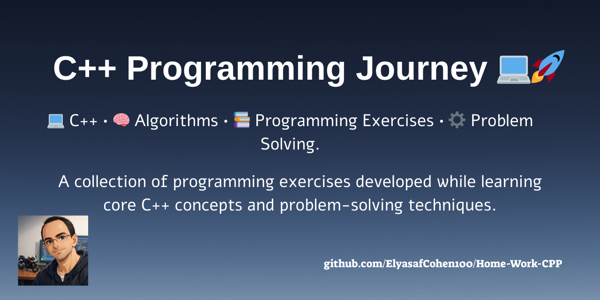
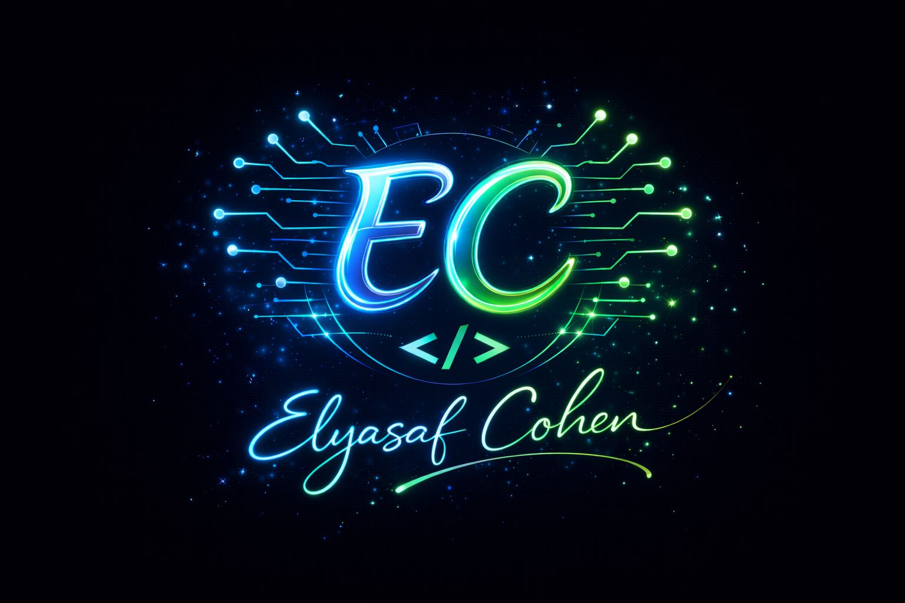

<p align="center">
  
</p>

# C++ Programming Journey 💻🚀📚  

📂 **Total Exercises:** 11  
💻 **Language:** C++  
📚 **Focus:** Programming Fundamentals 

---


> 🎓 **Course Assignments | C++ Programming**
> A collection of programming exercises created while learning and practicing C++ fundamentals.

---

## 🏷️ Technologies & Skills


---

## ✨ Overview ✨

This repository contains **11 programming exercises** developed as part of learning the **C++ programming language**.

The exercises focus on building strong foundations in:

- 🧠 logical thinking
- ⚙️ algorithmic problem solving
- 💻 writing structured code
- 📦 understanding programming concepts

Each assignment represents another step forward in the journey of mastering C++.

---

## 📊 Learning Progress

Throughout these exercises the following topics were practiced:

- 🔹 Variables & Data Types
- 🔹 Input / Output
- 🔹 Conditional Statements (`if`, `else`)
- 🔹 Loops (`for`, `while`)
- 🔹 Functions
- 🔹 Arrays
- 🔹 Algorithmic Thinking
- 🔹 Problem Solving

---

## 📚 Exercises Overview 📚

| Exercise | Folder |
|--------|------|
| 🧩 Exercise 1 | [📂 תרגיל הגשה מס 1](./תרגיל%20הגשה%20מס%201) |
| 🧩 Exercise 2 | [📂 תרגיל הגשה מס 2](./תרגיל%20הגשה%20מס%202) |
| 🧩 Exercise 3 | [📂 תרגיל הגשה מס 3](./תרגיל%20הגשה%20מס%203) |
| 🧩 Exercise 4 | [📂 תרגיל הגשה מס 4](./תרגיל%20הגשה%20מס%204) |
| 🧩 Exercise 5 | [📂 תרגיל הגשה מס 5](./תרגיל%20הגשה%20מס%205) |
| 🧩 Exercise 6 | [📂 תרגיל הגשה מס 6](./תרגיל%20הגשה%20מס%206) |
| 🧩 Exercise 7 | [📂 תרגיל הגשה מס 7](./תרגיל%20הגשה%20מס%207) |
| 🧩 Exercise 8 | [📂 תרגיל הגשה מס 8](./תרגיל%20הגשה%20מס%208) |
| 🧩 Exercise 9 | [📂 תרגיל הגשה מס 9](./תרגיל%20הגשה%20מס%209) |
| 🧩 Exercise 10 | [📂 תרגיל הגשה מס 10](./תרגיל%20הגשה%20מס%2010) |
| 🧩 Exercise 11 | [📂 תרגיל הגשה מס 11](./תרגיל%20הגשה%20מס%2011) |

---

## 📁 Repository Structure 📁

```bash
Home-Work-CPP
│
├── תרגיל הגשה מס 1
├── תרגיל הגשה מס 2
├── תרגיל הגשה מס 3
├── תרגיל הגשה מס 4
├── תרגיל הגשה מס 5
├── תרגיל הגשה מס 6
├── תרגיל הגשה מס 7
├── תרגיל הגשה מס 8
├── תרגיל הגשה מס 9
├── תרגיל הגשה מס 10
├── תרגיל הגשה מס 11
│
└── README.md
```

---

## 🛠️ How to Compile & Run 🛠️

Open the project using an IDE such as:

- 💻 Visual Studio
- 💻 CLion
- 💻 Code::Blocks
- 💻 VS Code

---

## 🎯 Learning Goal 🎯

This repository was created to:

- 🚀 strengthen C++ programming skills
- 🧠 develop algorithmic thinking
- 💻 practice writing clean and readable code
- ⚙️ improve problem solving abilities

---

## Create with good vibes by: 🎉

<p align="center">
  
</p>
                             
<p align="center">                    
  <a href="https://github.com/ElyasafCohen100">
     
  </a>
</p>

---

> ✨ If you like this project – please leave a star! ✨
